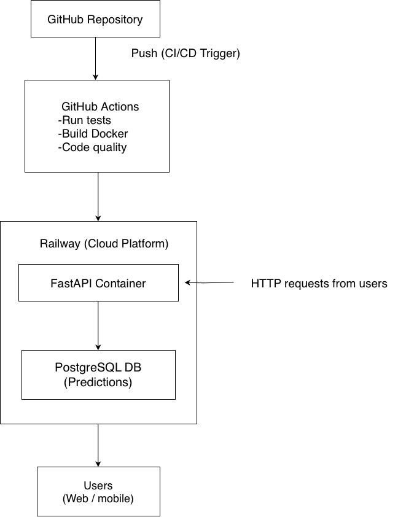

# Customer Churn Prediction (Machine Learning Pipeline + FastAPI + PostgreSQL + Docker + Railway)

Live API: https://ml-churn-prediction-production-1ab7.up.railway.app  
API Docs: https://ml-churn-prediction-production-1ab7.up.railway.app/docs

Note: The application was deployed and running on Railway during development. The Railway free tier has since expired, so the live instance is no longer active. All core functionality, deployment steps and results are documented through screenshots, logs and diagrams included in this repository.

This project predicts customer churn using a complete machine learning workflow and a fully deployed backend service. It started as a simple model training notebook and gradually turned into a full backend system with FastAPI, PostgreSQL logging, Docker and cloud deployment on Railway. The API can serve predictions in real time, store them in a database, provide summary statistics and expose model information.

## 1. Overview

The main idea behind this project is to identify customers who are likely to churn based on demographic features, service usage patterns and contract details. I trained and compared multiple models, built an API around the best-performing one and deployed everything in a way that behaves like a small production system. The project was also a way to practice good engineering habits: clean structure, testing, version control, reproducibility and infrastructure setup.

## 2. Features Implemented

- Dataset exploration, cleaning and feature engineering  
- ML model training (Logistic Regression and Random Forest)  
- Detailed evaluation metrics and model comparison  
- Saving preprocessing and model pipelines for inference  
- FastAPI application for real-time predictions  
- PostgreSQL integration to store predictions, probabilities and model metrics  
- Analytics endpoints for churn statistics and history  
- Model metadata endpoint  
- Automated tests with pytest  
- Docker image for API + PostgreSQL with docker-compose  
- Railway deployment using Dockerfile + GitHub auto-deploy  
- Full documentation of the deployment process  

## 3. Model Results

| Model | Accuracy | F1 Score |
|------|----------|----------|
| Logistic Regression | 0.799 | 0.592 |
| Random Forest | 0.852 | 0.820 |

The Random Forest model is used by the API because it consistently performed better across precision, recall and F1.

## 4. Tech Stack

### Machine Learning
- pandas  
- numpy  
- scikit-learn  
- joblib

### Backend
- FastAPI  
- Uvicorn  
- Pydantic  
- SQLAlchemy ORM  

### Database
- PostgreSQL  
- SQLAlchemy Core and ORM  
- Railway managed PostgreSQL

### Infrastructure & Deployment
- Docker  
- docker-compose  
- Railway (Docker runtime and PostgreSQL hosting)  
- bash scripts  
- environment variables

### Testing & CI/CD
- pytest  
- GitHub Actions  
- Black, isort, Flake8

## 5. Project Structure

ml-churn-prediction/  
├── data/  
├── models/  
├── notebooks/  
├── src/  
├── scripts/  
├── tests/  
├── Dockerfile  
├── docker-compose.yml  
├── RAILWAY_DEPLOYMENT.md  
└── requirements.txt  

## 6. Architecture Diagram

This diagram explains how code moves from GitHub to Railway and how users interact with the deployed API.

## 7. API Endpoints

POST /predict — run a churn prediction and log it in the database  
GET /health — check API and database status  
GET /stats — aggregated churn statistics  
GET /history — recent prediction logs  
GET /model-info — model metadata  

Swagger UI:

Local: http://localhost:8000/docs  
Railway: https://ml-churn-prediction-production-1ab7.up.railway.app/docs  

## 8. Docker Usage (Local)

Start all services:  
docker-compose up

Run in background:  
docker-compose up -d

Stop services:  
docker-compose down

Rebuild after updates:  
docker-compose up --build

View API logs:  
docker-compose logs -f api

Access PostgreSQL:  
docker exec -it churn-postgres psql -U churnuser -d churn_db

## 9. Railway Deployment

The application is deployed on Railway using a Dockerfile, GitHub auto-deploy and a managed PostgreSQL database.

Base URL: https://ml-churn-prediction-production-1ab7.up.railway.app  
API Docs: https://ml-churn-prediction-production-1ab7.up.railway.app/docs  

Railway redeploys automatically when code is pushed to the main branch.

Full deployment steps can be found in `RAILWAY_DEPLOYMENT.md`.

## 10. CI/CD Pipeline

GitHub Actions handle:

- Running pytest  
- Code formatting checks  
- Building and pushing the Docker image to Docker Hub  
  (repository: zhalamehdili/ml-churn-prediction)  

This ensures the project stays consistent, working and reproducible.

## 11. Screenshots

- Swagger UI (`screenshots/01-swagger-ui.png`)  
- Health check (`screenshots/02-health-check.png`)  
- Prediction examples (`screenshots/03-prediction-example-1.png`, `03-prediction-example-2.png`)  
- Stats (`screenshots/04-stats-analytics.png`)  
- Prediction history (`screenshots/05-prediction-history.png`)  
- GitHub Actions (`screenshots/06-github-actions.png`)  
- Railway dashboard (`screenshots/07-railway-dashboard.png`)  

## 12. Project Status

- Data exploration and model training: complete  
- FastAPI backend: complete  
- Database integration: complete  
- Docker setup: complete  
- CI/CD pipeline: complete  
- Railway deployment: complete  
- Documentation: complete